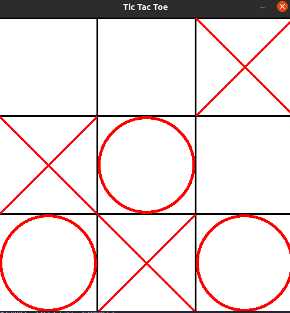

# Tic Tac Toe




## Description
This simple Tic Tac Toe game written in python has you play against the computer. 
The computer uses a simple algorithm to determine if a spot is available and if it is, it will place its marker there.
The algorithm is not perfect and can be beaten.

## How to play
There is some configuration that can be done in the `config.py` file.

Firstly, install `requirements.txt` using 

```bash
pip install -r requirements.txt
```

Then edit the `config.py` file to your liking. The options are as follows:

```python

    player = "X" # Player can either be "X" or "O"

    #set window size (width, height) in pixels
    WINDOW_SIZE = [500, 500]

    # number of rows and columns, would advise 3x3
    ROWS, COLS = 3, 3

```

Then run the `main.py` file using

```bash
python3 main.py
```

## How it works

You play against the computer. The computer uses a simple algorithm to determine if a spot is available and if it is, it will place its marker there.

There is an alogrithm that checks after each move to see if there is a winner. If there is a winner, the game will end and the winner will be displayed in the console.

TODO:
- [ ] Add a GUI end screen
- [ ] Add a GUI start screen (with options)
- [ ] Make the computer harder to beat
- [ ] Make the check for a winner algorithm more efficient


